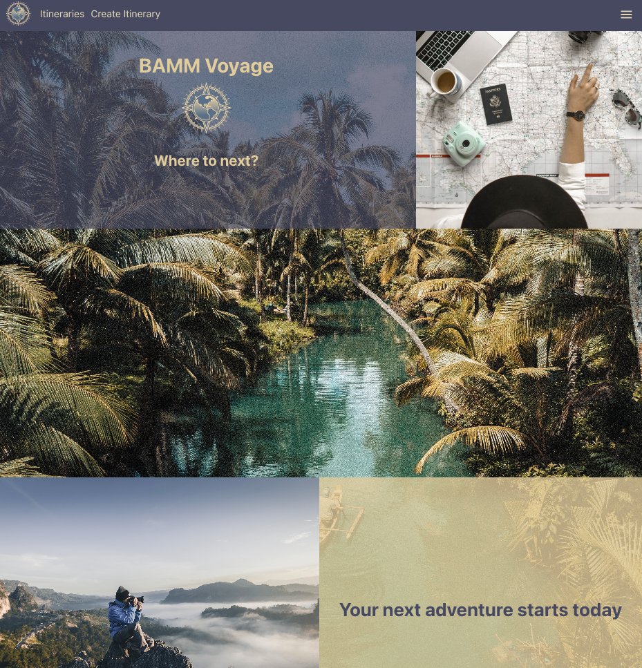
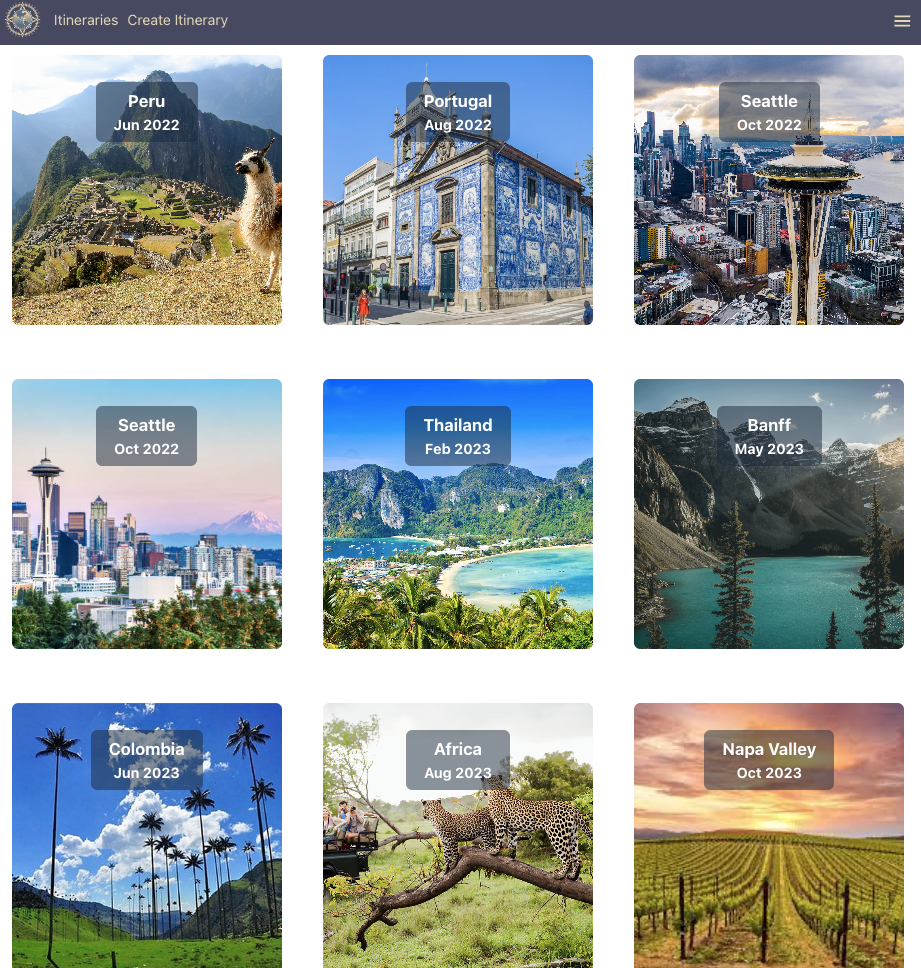

# BAMM Voyage

## Overview

Welcome to the BAMM Voyage Front-End repository! This repository contains the front-end code for the BAMM Voyage application.

At BAMM Voyage (pronounced like Bon Voyage), we share a passion for travel and understand the challenges that come with planning trips. We have experienced firsthand how travel planning can become complicated and messy without the right tools. Therefore, we decided to create this app to help solve that issue and provide users with a streamlined and efficient way to plan their journeys.

# Links 🔗

- [PitchDeck](https://docs.google.com/presentation/d/1Nrj_1rN6D0FwDB-EJoClxOx6Qps2g5nUOta-EUGs45g/edit#slide=id.g241b0af04a2_0_8)
- [Trello](https://trello.com/b/9GNNPfib/bamm-voyage)
- [Whimsical](https://whimsical.com/travel-itinerary-VwbMGamKd9otzoQ9L4HH7E)
- [Back-End Server](https://github.com/CurrentlyBob/bamm-voyage-back-end)

# Contributors:

- [Bobby Walsh](https://github.com/CurrentlyBob)
- [Andrea Bances-Monard](https://github.com/andrea1234321)
- [Melvin Fontanez](https://github.com/mfontanez21)
- [Monica Scoletti](https://github.com/MonicaSue)

# Attributions:

- [moment.js](https://momentjs.com/)
- [mui](https://mui.com/)
- [emotion](https://www.npmjs.com/package/@emotion/react)
- [Default Image](https://www.istockphoto.com/photo/airplane-and-cloud-gm491102352-75578019?phrase=black+and+white+plane) by [nathaphat](https://www.istockphoto.com/portfolio/nathaphat?mediatype=photography)
- [Assets](https://unsplash.com/)

# Technologies Used

## BAAM Voyage was built using the following technologies:

- JavaScript
- CSS
- GitHub
- MongoDB
- Express.js
- React.js
- Node.js
- Passport.js

# IceBox 🧊

- [ ] Trip Recommendations
- [ ] Budgeting Tools
- [ ] Language Translation
- [ ] Travel Guides
- [ ] Trip Sharing
- [ ] Integration with External APIs
- [ ] Trip Analytics
